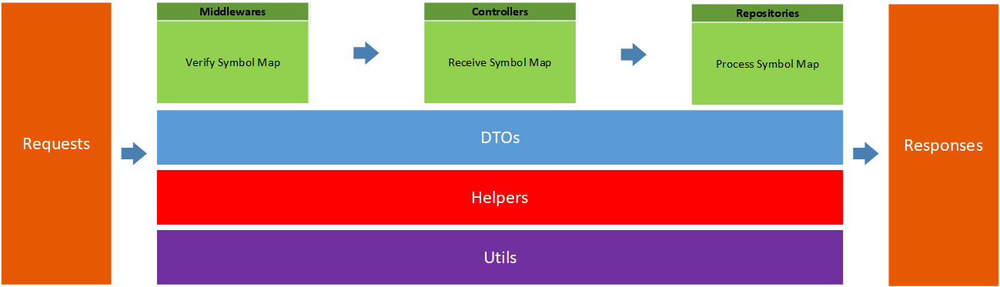

# Backend for the Slot Machine
The project takes symbol map for computing and returns score.



## Package Requirements

#### SMachine.API
- Microsoft.AspNetCore.App
- NSwag.AspNetCore

#### SMachine.API.Tests
- Microsoft.AspNetCore.Mvc.Abstractions
- Microsoft.AspNetCore.Mvc.Core
- Microsoft.AspNetCore.Mvc.ViewFeatures
- nunit
- NUnit3TestAdapter
- Moq

## Usage

#### SMachine.API
Enter `src/Backend/SMachine.API`, and then run command:
```csharp
dotnet run
```

#### SMachine.API.Tests
Enter `src/Backend/SMachine.API.Tests`, and then run command:
```csharp
dotnet test
```

## OpenAPIs/Swagger
swagger link
```csharp
http://localhost:5000/swagger
```
swagger.json link
```csharp
http://localhost:5000/swagger/v1/swagger.json
```

## Directory Structure

#### SMachine.API

    │   ├───SMachine.API
    │   │   ├───Controllers
    │   │   ├───DTOs
    │   │   ├───Helpers
    │   │   ├───Middlewares
    │   │   ├───Repositories
    │   │   └───Utils

##### Controller
- `CalcController.cs` receives requests and invokes methods from Repository.

##### DTOs
- `Score.cs` defines data structure for response of controller.
- `Symbol.cs` defines symbol types.  
- `SymbolMap.cs` defines data structure for `Symbol Map`. It includes three members which have the type of `WinLine`.  
- `WinLine.cs` defines data structure for Winning-Line.

##### Helpers
- `SymbolHelpers.cs` defines a few functions for processing Winning-Lines.

##### Middlewares
- `ValidationSymbolMapsMiddleware.cs` verifies the SymbolMap from requests.
- `ValidationSymbolMapsMiddlewareExtensions.cs` is an extension of IApplicationBuilder for adding the middleware.

##### Repositories
- `IScoreRepository.cs` is an interface for ScoreRepoitory. 
- `ScoreRepository.cs` defines an method which receives SymbolMap from controller and returns `Score Object` to controller.

##### Utils
- `BarRules.cs` defines rules for Bar, 2xBar and 3xBar.
- `CherryRules.cs` defines rules for Cherry.
- `CombinationRules.cs` defines rules for 7&Cherry and any bars.
- `SevenRules.cs` defines rules for 7.
- `WinLinesBuilder.cs` transfers `WinLine Object` to `IList<Symbol> object`.


#### SMachine.API.Tests


    │   └───SMachine.API.Tests
    │       ├───Controllers
    │       ├───Helpers
    │       ├───Middlewares
    │       ├───Repositories
    │       └───Utils


## Computing Rules
- 3 CHERRY symbols on top line 2000
- 3 CHERRY symbols on center line 1000
- 3 CHERRY symbols on bottom line 4000
- 3 7 symbols on any line 150
- Any combination of CHERRY and 7 on any line 75
- 3 3xBAR symbols on any line 50
- 3 2xBAR symbols on any line 20
- 3 BAR symbols on any line 10
- Combination of any BAR symbols on any line 5